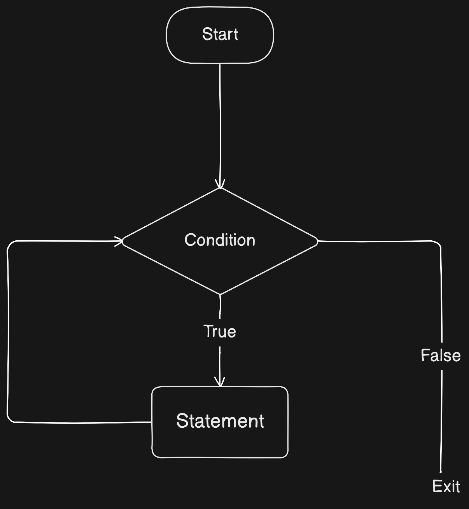

## For Loops
- for loop is used to iterate over a sequence such as list, tuple, set, dictionary, string, etc.

### Syntax:
```python
for item in sequence:
    # code to be executed for each item in sequence
```

### Flowchart:


### Example 1 (For loop with string):
```python
name = "John"
for char in name:
    print(char)
```

### Example 2 (For loop with list):
```python
marks = [90, 80, 70, 60, 50]
sum = 0
for mark in marks:
    sum += mark

print("Total marks: ", sum)
```

### Example 3 (For loop with tuple):
```python
marks = (90, 80, 70, 60, 50)
sum = 0
for mark in marks:
    sum += mark

print("Total marks: ", sum)
```

### Example 4 (For loop with set):
```python
marks = {90, 80, 70, 60, 50}
sum = 0
for mark in marks:
    sum += mark

print("Total marks: ", sum)
```

### Example 5 (For loop with dictionary):
```python
marks = {
    "Maths": 90,
    "Science": 80,
    "English": 70,
    "Hindi": 60,
    "Social Science": 50
    }
sum = 0
for subject in marks: # iterates over keys
    sum += marks[subject]

print("Total marks: ", sum)
```

### Example 6 (For loop with dictionary):
```python
marks = {
    "Maths": 90,
    "Science": 80,
    "English": 70,
    "Hindi": 60,
    "Social Science": 50
    }

print(marks.items()) # prints list of tuples

# prints key and value
for subject, mark in marks.items():
    print(subject, mark)


for item in marks:
    print(item) # prints key
```


## While Loops
- while loop is used to execute a block of code as long as a condition is true
- The condition is checked before executing the code inside the while loop
- If the condition is true, the code inside the while loop is executed

### Syntax:
```python
while condition:
    # code to be executed if condition is true
```

### Flowchart:


### Example 1:
```python
i = 1
while i <= 5:
    print(i)
    i += 1
```

# Break Statement
- break statement is used to terminate a loop
- It is used inside a loop
- When a break statement is encountered inside a loop, the loop is terminated and the control is passed to the next statement after the loop

### Syntax:
```python
while condition:
    # code to be executed if condition is true
    if condition:
        break
```

### Example 1:
```python
i = 1
while i <= 5:
    print(i)
    if i == 3:
        break
    i += 1
```

### Real world use case of break statement:
- Search for an element in a list
- If the element is found, stop searching

```python
numbers = [10, 18, 21, 17, 91]
search_number = 17

for number in numbers:
    if number == search_number:
        print("Number found")
        break
else:
    print("Number not found")
```

### Input Validation:
Continue to ask for input until the user enters a valid positive number

```python
while True:
    number = input("Enter a positive number: ")
    if number.isdigit() and int(number) > 0:
        break
    else:
        print("Invalid input ❌. Please enter a positive number")

print("The number is: ", number)
```


# Continue Statement
- continue statement is used to skip the current iteration of a loop

### Syntax:
```python
while condition:
    # code to be executed if condition is true
    if condition:
        continue
```

### Example 1:
```python

for i in range(1, 6):
    if i == 3:
        continue
    print(i)
```

### Real world use case of continue statement:
- Print all the odd numbers in a list

```python
numbers = [10, 18, 21, 17, 91]

for number in numbers:
    if number % 2 == 0:
        continue
    print(number)
```

# Pass Statement
- pass statement is used to do nothing
- It is used when a statement is required syntactically but you do not want any command or code to execute

### Syntax:
```python
for i in range(1, 6):
    if i == 3:
        pass
    print(i)
```

### Real world use case of pass statement:

```python
for i in range(1, 6):
    if i == 3:
        pass
    print(i)
```


